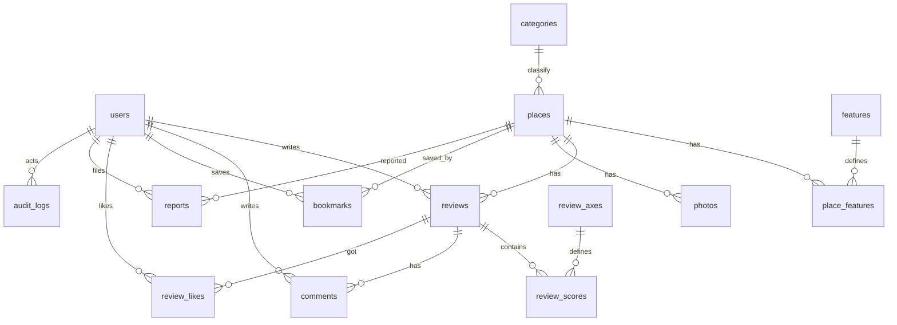

# 子連れ向けスポット検索アプリ — データベース設計（PostgreSQL + PostGIS）
作成日: 2025-08-27 / 版: v1.1（「設備・サービス」表現に統一）

本書は要件定義（MVP）に基づく**論理設計 + 物理設計（DDL案）**です。  
対象: PostgreSQL 15 以上 + PostGIS 3.x 前提。全文検索は `pg_trgm`/`tsvector` を使用。

---

## 0. 命名規約 / 共通方針
- **スキーマ**: `public`（必要に応じて分離可）  
- **命名**: `snake_case`、英字のみ、複数形テーブル。PK は `id`（UUID）、FK は `<referenced>_id`  
- **時刻**: `timestamptz`（UTC保管）、`created_at`/`updated_at` を全表に付与（`updated_at` はトリガー更新）  
- **削除**: 物理削除が基本。審査対象は `status` で制御  
- **地理**: `geography(Point,4326)` を採用（距離計算に最適）。距離/近接は KNN 対応 GiST インデックス  
- **全文検索**: 生成列 `search_vector`（`tsvector`）に GIN インデックス  
- **拡張**: `uuid-ossp`, `pgcrypto`, `postgis`, `pg_trgm`, `citext`（Email に使用）

---

## 1. ER 図（Mermaid）


---

## 2. マスタ / 列挙（ENUM or マスタテーブル）
### 2.1 ENUM（PostgreSQL `CREATE TYPE`）
- `user_role`: `member`, `moderator`, `admin`
- `review_status`: `public`, `pending`, `hidden`
- `report_status`: `open`, `resolved`, `rejected`

> カテゴリ/年齢帯/**設備・サービス**/評価軸は将来拡張を見込んで**マスタテーブル**で管理。

---

## 3. テーブル定義（論理設計）
### 3.1 users（会員）
- `id` UUID PK
- `email` UNIQUE, 非NULL
- `password_hash`（外部Authなら不要）
- `nickname` INDEX
- `home_area`（任意）
- `child_age_band_id`（任意、年齢帯マスタ参照）
- `role` ENUM `user_role`（デフォルト `member`）
- `created_at`, `updated_at`

### 3.2 categories（施設カテゴリ）
- `id` PK
- `code` UNIQUE（例: `park`, `indoor_kids`, `restaurant`, ...）
- `label` 表示名
- `sort` 並び順

### 3.3 places（施設）
- `id` PK
- `name`, `kana`（任意）
- `category_id` FK → categories
- `description`
- `address`, `phone`, `website_url`
- `price_range`（例: `¥`, `¥¥`, `¥¥¥`）
- `opening_hours_json`（Google 形式互換を想定）
- `geog` `geography(Point,4326)`
- `lat`, `lng`（冗長だが利便のため保持可・生成列も可）
- `google_place_id`（任意）
- `search_vector` `tsvector`（生成列）
- `created_at`, `updated_at`

### 3.4 features（設備・サービス マスタ）
- `id` PK
- `code` UNIQUE（`diaper_table`, `nursing_room`, `kids_toilet`, `stroller_ok`, ...）
- `label` 表示名
- `category`（系統：トイレ/移動/飲食 など）
- `description`（任意）

### 3.5 place_features（施設×設備・サービス）
- `place_id` FK → places
- `feature_id` FK → features
- `value`（BOOLEAN or SMALLINT：有無/数量）
- `detail`（任意）
- **PK**: `(place_id, feature_id)`

### 3.6 review_axes（レビュー評価軸マスタ）
- `id` PK
- `code` UNIQUE（`cleanliness`, `nursing_room_quality`, `diaper_table`, `stroller_access`, `kids_menu`, ...）
- `label`
- `weight_default`（総合スコアの重み初期値）
- `category_filter`（任意：飲食のみ等）
- `sort`

### 3.7 reviews（レビュー）
- `id` PK
- `place_id` FK → places
- `user_id` FK → users
- `overall` 1〜5（CHECK）
- `age_band_id` FK → age_bands（任意）
- `stay_minutes`（任意）
- `revisit_intent` 1〜5（任意）
- `text`
- `photos_json`（格納 or 別表 `photos` 推奨）
- `status` ENUM `review_status`（デフォルト `public`）
- `created_at`, `updated_at`

### 3.8 review_scores（レビュー詳細スコア）
- `review_id` FK → reviews
- `axis_id` FK → review_axes
- `score` 1〜5（CHECK）
- **PK**: `(review_id, axis_id)`

### 3.9 comments（コメント）
- `id` PK
- `review_id` FK → reviews
- `user_id` FK → users
- `text`
- `status`（`public`/`hidden` 等 ※ENUM化してもよい）
- `created_at`, `updated_at`

### 3.10 review_likes（参考になった）
- `review_id` FK → reviews
- `user_id` FK → users
- **PK**: `(review_id, user_id)`

### 3.11 bookmarks（ブックマーク）
- `user_id` FK → users
- `place_id` FK → places
- `created_at`
- **PK**: `(user_id, place_id)`

### 3.12 photos（写真）
- `id` PK
- `place_id`（施設の写真）または `review_id`（レビュー写真）※いずれか必須
- `storage_path` or `url`
- `width`, `height`, `blurhash`（任意）
- `created_at`

### 3.13 reports（通報）
- `id` PK
- `target_type`（`place`/`review`/`comment`）
- `target_id`
- `reporter_id` FK → users
- `reason_code`, `detail`
- `status` ENUM `report_status`（デフォルト `open`）
- `created_at`, `updated_at`

### 3.14 audit_logs（監査ログ）
- `id` PK
- `actor_user_id` FK → users
- `action`（`moderate_review`, `update_place`, ...）
- `target_type`, `target_id`
- `diff_json`
- `created_at`

### 3.15 age_bands（年齢帯マスタ）
- `id` PK
- `code` UNIQUE（`baby_0_1`, `toddler_2_3`, `preschool_4_6`, `early_grade_7_9`）
- `label`
- `sort`

---

## 4. 物理設計（DDL スクリプト案）
> 開発開始時に一括実行。必要に応じマイグレーションツール（Prisma/Flyway/Dbmate等）で管理。

```sql
-- Extensions
CREATE EXTENSION IF NOT EXISTS "uuid-ossp";
CREATE EXTENSION IF NOT EXISTS postgis;
CREATE EXTENSION IF NOT EXISTS pg_trgm;
CREATE EXTENSION IF NOT EXISTS citext;

-- ENUM Types
DO $$ BEGIN
    CREATE TYPE user_role AS ENUM ('member','moderator','admin');
EXCEPTION WHEN duplicate_object THEN NULL; END $$;

DO $$ BEGIN
    CREATE TYPE review_status AS ENUM ('public','pending','hidden');
EXCEPTION WHEN duplicate_object THEN NULL; END $$;

DO $$ BEGIN
    CREATE TYPE report_status AS ENUM ('open','resolved','rejected');
EXCEPTION WHEN duplicate_object THEN NULL; END $$;

-- Utility: updated_at trigger
CREATE OR REPLACE FUNCTION set_updated_at()
RETURNS trigger LANGUAGE plpgsql AS $$
BEGIN
  NEW.updated_at = NOW();
  RETURN NEW;
END $$;

-- age_bands
CREATE TABLE IF NOT EXISTS age_bands (
  id          uuid PRIMARY KEY DEFAULT uuid_generate_v4(),
  code        text UNIQUE NOT NULL,
  label       text NOT NULL,
  sort        int  NOT NULL DEFAULT 100
);

-- users
CREATE TABLE IF NOT EXISTS users (
  id              uuid PRIMARY KEY DEFAULT uuid_generate_v4(),
  email           citext UNIQUE NOT NULL,
  password_hash   text, -- 外部Authの場合はNULL許容
  nickname        text NOT NULL,
  home_area       text,
  child_age_band_id uuid REFERENCES age_bands(id),
  role            user_role NOT NULL DEFAULT 'member',
  created_at      timestamptz NOT NULL DEFAULT NOW(),
  updated_at      timestamptz NOT NULL DEFAULT NOW()
);
CREATE INDEX IF NOT EXISTS idx_users_nickname ON users (nickname);
CREATE TRIGGER trg_users_updated_at BEFORE UPDATE ON users
FOR EACH ROW EXECUTE FUNCTION set_updated_at();

-- categories
CREATE TABLE IF NOT EXISTS categories (
  id      uuid PRIMARY KEY DEFAULT uuid_generate_v4(),
  code    text UNIQUE NOT NULL,
  label   text NOT NULL,
  sort    int NOT NULL DEFAULT 100
);

-- places
CREATE TABLE IF NOT EXISTS places (
  id          uuid PRIMARY KEY DEFAULT uuid_generate_v4(),
  name        text NOT NULL,
  kana        text,
  category_id uuid NOT NULL REFERENCES categories(id),
  description text,
  address     text,
  phone       text,
  website_url text,
  price_range text,
  opening_hours_json jsonb,
  geog        geography(Point,4326) NOT NULL,
  lat         double precision GENERATED ALWAYS AS (ST_Y(geog::geometry)) STORED,
  lng         double precision GENERATED ALWAYS AS (ST_X(geog::geometry)) STORED,
  google_place_id text,
  search_vector tsvector GENERATED ALWAYS AS (
      setweight(to_tsvector('simple', coalesce(name,'')), 'A') ||
      setweight(to_tsvector('simple', coalesce(description,'')), 'B') ||
      setweight(to_tsvector('simple', coalesce(address,'')), 'C')
  ) STORED,
  created_at  timestamptz NOT NULL DEFAULT NOW(),
  updated_at  timestamptz NOT NULL DEFAULT NOW()
);
CREATE INDEX IF NOT EXISTS idx_places_category ON places (category_id);
CREATE INDEX IF NOT EXISTS idx_places_geog ON places USING GIST (geog);
CREATE INDEX IF NOT EXISTS idx_places_search ON places USING GIN (search_vector);
CREATE TRIGGER trg_places_updated_at BEFORE UPDATE ON places
FOR EACH ROW EXECUTE FUNCTION set_updated_at();

-- features（設備・サービス）
CREATE TABLE IF NOT EXISTS features (
  id          uuid PRIMARY KEY DEFAULT uuid_generate_v4(),
  code        text UNIQUE NOT NULL,
  label       text NOT NULL,
  category    text,
  description text
);

-- place_features（施設×設備・サービス）
CREATE TABLE IF NOT EXISTS place_features (
  place_id    uuid NOT NULL REFERENCES places(id) ON DELETE CASCADE,
  feature_id  uuid NOT NULL REFERENCES features(id) ON DELETE CASCADE,
  value       smallint, -- 0/1 or 数量
  detail      text,
  PRIMARY KEY (place_id, feature_id)
);

-- review_axes
CREATE TABLE IF NOT EXISTS review_axes (
  id              uuid PRIMARY KEY DEFAULT uuid_generate_v4(),
  code            text UNIQUE NOT NULL,
  label           text NOT NULL,
  weight_default  real NOT NULL DEFAULT 1.0,
  category_filter text,
  sort            int NOT NULL DEFAULT 100
);

-- reviews
CREATE TABLE IF NOT EXISTS reviews (
  id            uuid PRIMARY KEY DEFAULT uuid_generate_v4(),
  place_id      uuid NOT NULL REFERENCES places(id) ON DELETE CASCADE,
  user_id       uuid NOT NULL REFERENCES users(id) ON DELETE CASCADE,
  overall       smallint NOT NULL CHECK (overall BETWEEN 1 AND 5),
  age_band_id   uuid REFERENCES age_bands(id),
  stay_minutes  int,
  revisit_intent smallint CHECK (revisit_intent BETWEEN 1 AND 5),
  text          text,
  photos_json   jsonb,
  status        review_status NOT NULL DEFAULT 'public',
  created_at    timestamptz NOT NULL DEFAULT NOW(),
  updated_at    timestamptz NOT NULL DEFAULT NOW(),
  UNIQUE (place_id, user_id, created_at)
);
CREATE INDEX IF NOT EXISTS idx_reviews_place ON reviews (place_id, status, created_at DESC);
CREATE INDEX IF NOT EXISTS idx_reviews_user ON reviews (user_id, created_at DESC);
CREATE TRIGGER trg_reviews_updated_at BEFORE UPDATE ON reviews
FOR EACH ROW EXECUTE FUNCTION set_updated_at();

-- review_scores
CREATE TABLE IF NOT EXISTS review_scores (
  review_id uuid NOT NULL REFERENCES reviews(id) ON DELETE CASCADE,
  axis_id   uuid NOT NULL REFERENCES review_axes(id) ON DELETE RESTRICT,
  score     smallint NOT NULL CHECK (score BETWEEN 1 AND 5),
  PRIMARY KEY (review_id, axis_id)
);

-- comments
CREATE TABLE IF NOT EXISTS comments (
  id         uuid PRIMARY KEY DEFAULT uuid_generate_v4(),
  review_id  uuid NOT NULL REFERENCES reviews(id) ON DELETE CASCADE,
  user_id    uuid NOT NULL REFERENCES users(id) ON DELETE CASCADE,
  text       text NOT NULL,
  status     text NOT NULL DEFAULT 'public',
  created_at timestamptz NOT NULL DEFAULT NOW(),
  updated_at timestamptz NOT NULL DEFAULT NOW()
);
CREATE INDEX IF NOT EXISTS idx_comments_review ON comments (review_id, created_at DESC);
CREATE TRIGGER trg_comments_updated_at BEFORE UPDATE ON comments
FOR EACH ROW EXECUTE FUNCTION set_updated_at();

-- review_likes
CREATE TABLE IF NOT EXISTS review_likes (
  review_id uuid NOT NULL REFERENCES reviews(id) ON DELETE CASCADE,
  user_id   uuid NOT NULL REFERENCES users(id) ON DELETE CASCADE,
  created_at timestamptz NOT NULL DEFAULT NOW(),
  PRIMARY KEY (review_id, user_id)
);

-- bookmarks
CREATE TABLE IF NOT EXISTS bookmarks (
  user_id    uuid NOT NULL REFERENCES users(id) ON DELETE CASCADE,
  place_id   uuid NOT NULL REFERENCES places(id) ON DELETE CASCADE,
  created_at timestamptz NOT NULL DEFAULT NOW(),
  PRIMARY KEY (user_id, place_id)
);

-- photos
CREATE TABLE IF NOT EXISTS photos (
  id           uuid PRIMARY KEY DEFAULT uuid_generate_v4(),
  place_id     uuid REFERENCES places(id) ON DELETE CASCADE,
  review_id    uuid REFERENCES reviews(id) ON DELETE CASCADE,
  storage_path text NOT NULL,
  width        int,
  height       int,
  blurhash     text,
  created_at   timestamptz NOT NULL DEFAULT NOW(),
  CHECK ( (place_id IS NOT NULL) <> (review_id IS NOT NULL) )
);
CREATE INDEX IF NOT EXISTS idx_photos_place ON photos (place_id);
CREATE INDEX IF NOT EXISTS idx_photos_review ON photos (review_id);

-- reports
CREATE TABLE IF NOT EXISTS reports (
  id           uuid PRIMARY KEY DEFAULT uuid_generate_v4(),
  target_type  text NOT NULL, -- 'place' | 'review' | 'comment'
  target_id    uuid NOT NULL,
  reporter_id  uuid REFERENCES users(id) ON DELETE SET NULL,
  reason_code  text,
  detail       text,
  status       report_status NOT NULL DEFAULT 'open',
  created_at   timestamptz NOT NULL DEFAULT NOW(),
  updated_at   timestamptz NOT NULL DEFAULT NOW()
);
CREATE INDEX IF NOT EXISTS idx_reports_status ON reports (status, created_at DESC);
CREATE TRIGGER trg_reports_updated_at BEFORE UPDATE ON reports
FOR EACH ROW EXECUTE FUNCTION set_updated_at();

-- audit_logs
CREATE TABLE IF NOT EXISTS audit_logs (
  id             uuid PRIMARY KEY DEFAULT uuid_generate_v4(),
  actor_user_id  uuid REFERENCES users(id),
  action         text NOT NULL,
  target_type    text,
  target_id      uuid,
  diff_json      jsonb,
  created_at     timestamptz NOT NULL DEFAULT NOW()
);
CREATE INDEX IF NOT EXISTS idx_audit_logs_actor ON audit_logs (actor_user_id, created_at DESC);
```

---

## 5. 推奨インデックス/検索例
### 5.1 近接検索（距離順）
```sql
-- 5km 以内の施設を距離順
SELECT id, name,
       ST_Distance(geog, ST_SetSRID(ST_MakePoint(:lng,:lat),4326)::geography) AS dist_m
FROM places
WHERE ST_DWithin(geog, ST_SetSRID(ST_MakePoint(:lng,:lat),4326)::geography, 5000)
ORDER BY geog <-> ST_SetSRID(ST_MakePoint(:lng,:lat),4326)::geography
LIMIT 50;
```

### 5.2 全文検索 + フィルタ
```sql
SELECT id, name
FROM places
WHERE search_vector @@ plainto_tsquery('simple', :q)
  AND category_id = :category_id
ORDER BY ts_rank(search_vector, plainto_tsquery('simple', :q)) DESC
LIMIT 50;
```

### 5.3 総合スコア（例：距離20% + 子連れスコア50% + 件数/新着/写真）
> 実装はビューやマテビューに切り出し推奨。

---

## 6. RLS（Row Level Security）例（Supabase等での利用を想定）
> 本設計はDB側のRLSで**ユーザー自身のデータのみ**更新可能にする例です。

```sql
-- 例: bookmarks
ALTER TABLE bookmarks ENABLE ROW LEVEL SECURITY;

CREATE POLICY "select own and public bookmarks"
  ON bookmarks FOR SELECT
  USING (true);

CREATE POLICY "insert own bookmarks"
  ON bookmarks FOR INSERT
  WITH CHECK (auth.uid() = user_id);

CREATE POLICY "delete own bookmarks"
  ON bookmarks FOR DELETE
  USING (auth.uid() = user_id);
```

---

## 7. 初期データ（サンプル）
```sql
INSERT INTO age_bands (code,label,sort) VALUES
('baby_0_1','0-1歳',10),
('toddler_2_3','2-3歳',20),
('preschool_4_6','4-6歳',30),
('early_grade_7_9','7-9歳',40)
ON CONFLICT DO NOTHING;

INSERT INTO categories (code,label,sort) VALUES
('park','公園',10),
('indoor_kids','屋内キッズ',20),
('restaurant','飲食店',30),
('mall','商業施設',40),
('library','図書館',50)
ON CONFLICT DO NOTHING;

INSERT INTO features (code,label,category) VALUES
('diaper_table','おむつ交換台','restroom'),
('nursing_room','授乳室','restroom'),
('kids_toilet','キッズトイレ','restroom'),
('stroller_ok','ベビーカーOK','access'),
('elevator','エレベーター','access'),
('kids_menu','キッズメニュー','food'),
('allergy_label','アレルギー表示','food')
ON CONFLICT DO NOTHING;

INSERT INTO review_axes (code,label,weight_default,sort) VALUES
('cleanliness','清潔さ',1.0,10),
('nursing_room_quality','授乳室の使いやすさ',1.2,20),
('diaper_table','おむつ交換',1.2,30),
('stroller_access','ベビーカー移動',1.0,40),
('kids_menu','キッズメニュー',1.0,50)
ON CONFLICT DO NOTHING;
```

---

## 8. 運用メモ
- 定期的に `VACUUM (ANALYZE)`、`REINDEX`（必要時）
- 画像は外部ストレージ（例: Supabase Storage/S3）に保存し、URL/パスのみ保持
- `search_vector` の辞書（`simple`）は必要に応じ `japanese` 拡張を検討
- 近接検索の半径・件数は API レート/コストを見ながら調整

---

## 9. 変更容易性
- 施設カテゴリ/**設備・サービス**/評価軸は**マスタ**で運用（コードは不変に保つ）
- 評価軸の重みは将来 A/B テストで動的に変更できるよう `weight_default` を採用

---

## 10. 既知の未決事項
- SNSログイン採用時の `users` 構造の簡素化（`password_hash` 廃止）
- スパム対策（レート制限・機械判定スコアの項目追加）
- 位置情報の精度/匿名化ポリシー（集計用途）

---

以上。
