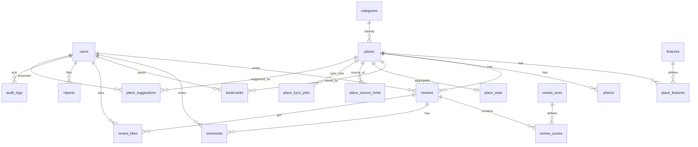

# 子連れ向けスポット検索アプリ — データベース設計 v0.2（PostgreSQL + PostGIS）
作成日: 2025-09-03 / 版: v0.2

本書は要件定義 v0.2 を反映した **論理設計＋DDL案** です。  
キーワード：**サービス（設備・サービス / features）で検索・表示**, **Google Place ID 連携**, **ローカル画像保存**, **簡易情報の距離順リスト**。

---

## 0. v0.2 差分（前版からの主な変更）
- 用語：UIは「**サービス**」表記、DB/APIは `features` を継続採用。
- 施設データの取得元管理：`google_place_id` を `places` に追加（ユニーク）、`data_source`（`google` / `manual`）。
- 同期メタ／ジョブ管理を追加：`place_source_meta`（取得元の原文JSON等），`place_sync_jobs`（取込・更新のキュー/履歴）。
- 画像保存：**ローカル保存**前提で `photos.storage_path` を明確化（CDN等は将来拡張）。
- トップの**簡易情報**高速化のため、集計をもつ `place_stats` を追加（例：平均★、件数、写真数、最終レビュー時刻）。
- ユーザーからの**施設修正提案**に対応：`place_suggestions` を追加（承認フロー）。

---

## 1. ER 図（Mermaid）


---

## 2. マスタ / 列挙
### 2.1 ENUM
- `user_role`: `member`, `moderator`, `admin`
- `review_status`: `public`, `pending`, `hidden`
- `report_status`: `open`, `resolved`, `rejected`
- `data_source`: `google`, `manual`
- `sync_status`: `queued`, `running`, `succeeded`, `failed`
- `suggestion_status`: `pending`, `approved`, `rejected`

> カテゴリ/年齢帯/サービス（features）/評価軸は**マスタテーブル**運用。

---

## 3. テーブル定義（論理）
### 3.1 users（会員）
- `id` UUID PK
- `email`（UNIQUE）, `password_hash`（外部AuthならNULL）
- `nickname`, `home_area`, `child_age_band_id` → `age_bands`
- `role` `user_role`
- `created_at`, `updated_at`

### 3.2 categories（施設カテゴリ）
- `id`, `code`（UNIQUE）, `label`, `sort`

### 3.3 places（施設）
- `id`, `name`, `kana`
- `category_id` → `categories`
- `description`, `address`, `phone`, `website_url`, `price_range`
- `opening_hours_json`（Google互換）
- `geog` `geography(Point,4326)`（`lat`,`lng`は生成列）
- `google_place_id`（UNIQUE, NULL可）
- `data_source` `data_source`（`google` 既定）
- `manual_lock` BOOLEAN（TRUE時は同期で上書きしない）
- `search_vector` `tsvector`（名称/説明/住所）
- `created_at`, `updated_at`

### 3.4 features（サービス マスタ）
- `id`, `code`（UNIQUE）, `label`, `category`, `description`

### 3.5 place_features（施設×サービス）
- `place_id` → `places`
- `feature_id` → `features`
- `value`（BOOLEAN/SMALLINT：有無/数量）, `detail`
- **PK** `(place_id, feature_id)`

### 3.6 review_axes（レビュー評価軸マスタ）
- `id`, `code`（UNIQUE）, `label`, `weight_default`, `category_filter`, `sort`

### 3.7 reviews（レビュー）
- `id`, `place_id` → `places`, `user_id` → `users`
- `overall` 1..5, `age_band_id` → `age_bands`
- `stay_minutes`, `revisit_intent` 1..5, `text`
- `photos_json`（簡易格納 or `photos` 推奨）
- `status` `review_status`
- `created_at`, `updated_at`

### 3.8 review_scores（レビュー詳細スコア）
- `review_id` → `reviews`, `axis_id` → `review_axes`
- `score` 1..5, **PK** `(review_id, axis_id)`

### 3.9 comments（コメント）
- `id`, `review_id` → `reviews`, `user_id` → `users`
- `text`, `status`（`public`/`hidden`）, `created_at`, `updated_at`

### 3.10 review_likes（参考になった）
- `review_id`, `user_id`, `created_at`、**PK** `(review_id, user_id)`

### 3.11 bookmarks（ブックマーク）
- `user_id`, `place_id`, `created_at`、**PK** `(user_id, place_id)`

### 3.12 photos（写真：**ローカル保存**）
- `id` PK
- `place_id`（施設写真） or `review_id`（レビュー写真）※どちらか必須
- `storage_path`（例：`/media/places/xxxx.jpg`）
- `mime_type`, `width`, `height`, `blurhash`
- `created_at`
- CHECK: `XOR(place_id, review_id)`

### 3.13 reports（通報）
- `id`, `target_type`（`place|review|comment`）, `target_id`
- `reporter_id` → `users`, `reason_code`, `detail`
- `status` `report_status`, `created_at`, `updated_at`

### 3.14 audit_logs（監査ログ）
- `id`, `actor_user_id` → `users`, `action`, `target_type`, `target_id`
- `diff_json`, `created_at`

### 3.15 age_bands（年齢帯）
- `id`, `code`（UNIQUE）, `label`, `sort`

### 3.16 place_stats（施設集計・一覧最適化）
- `place_id` PK → `places`
- `avg_overall` NUMERIC(3,2)（平均★）
- `review_count` INT
- `photo_count` INT
- `last_reviewed_at` timestamptz
> 更新方法：トリガ/バッチ/マテリアライズド・ビューのいずれか

### 3.17 place_source_meta（取得元メタ）
- `id` PK
- `place_id` → `places`
- `provider` TEXT（`google`）
- `provider_place_id` TEXT（Google Place ID 複製）
- `raw_json` JSONB（取得原本）
- `fetched_at` timestamptz, `etag` TEXT（差分検知用）

### 3.18 place_sync_jobs（同期ジョブ）
- `id` PK
- `place_id` → `places`（NULL可：未登録のPlace ID取込時）
- `provider` TEXT, `provider_place_id` TEXT
- `status` `sync_status`, `scheduled_at`, `started_at`, `finished_at`
- `error_message` TEXT

### 3.19 place_suggestions（施設修正提案）
- `id` PK
- `place_id` → `places`, `user_id` → `users`
- `payload` JSONB（提案内容：フィールドと値のペア）
- `status` `suggestion_status`（`pending` 既定）
- `reviewer_user_id` → `users`（承認/却下者）
- `reviewed_at` timestamptz, `note` TEXT
- `created_at`, `updated_at`

---

## 4. 物理設計（DDL スクリプト案）
```sql
-- Extensions
CREATE EXTENSION IF NOT EXISTS "uuid-ossp";
CREATE EXTENSION IF NOT EXISTS postgis;
CREATE EXTENSION IF NOT EXISTS pg_trgm;
CREATE EXTENSION IF NOT EXISTS citext;

-- ENUM Types
DO $$ BEGIN CREATE TYPE user_role AS ENUM ('member','moderator','admin'); EXCEPTION WHEN duplicate_object THEN NULL; END $$;
DO $$ BEGIN CREATE TYPE review_status AS ENUM ('public','pending','hidden'); EXCEPTION WHEN duplicate_object THEN NULL; END $$;
DO $$ BEGIN CREATE TYPE report_status AS ENUM ('open','resolved','rejected'); EXCEPTION WHEN duplicate_object THEN NULL; END $$;
DO $$ BEGIN CREATE TYPE data_source AS ENUM ('google','manual'); EXCEPTION WHEN duplicate_object THEN NULL; END $$;
DO $$ BEGIN CREATE TYPE sync_status AS ENUM ('queued','running','succeeded','failed'); EXCEPTION WHEN duplicate_object THEN NULL; END $$;
DO $$ BEGIN CREATE TYPE suggestion_status AS ENUM ('pending','approved','rejected'); EXCEPTION WHEN duplicate_object THEN NULL; END $$;

-- updated_at trigger
CREATE OR REPLACE FUNCTION set_updated_at() RETURNS trigger LANGUAGE plpgsql AS $$
BEGIN NEW.updated_at = NOW(); RETURN NEW; END $$;

-- age_bands
CREATE TABLE IF NOT EXISTS age_bands (
  id    uuid PRIMARY KEY DEFAULT uuid_generate_v4(),
  code  text UNIQUE NOT NULL,
  label text NOT NULL,
  sort  int NOT NULL DEFAULT 100
);

-- users
CREATE TABLE IF NOT EXISTS users (
  id                uuid PRIMARY KEY DEFAULT uuid_generate_v4(),
  email             citext UNIQUE NOT NULL,
  password_hash     text,
  nickname          text NOT NULL,
  home_area         text,
  child_age_band_id uuid REFERENCES age_bands(id),
  role              user_role NOT NULL DEFAULT 'member',
  created_at        timestamptz NOT NULL DEFAULT NOW(),
  updated_at        timestamptz NOT NULL DEFAULT NOW()
);
CREATE INDEX IF NOT EXISTS idx_users_nickname ON users (nickname);
CREATE TRIGGER trg_users_updated_at BEFORE UPDATE ON users FOR EACH ROW EXECUTE FUNCTION set_updated_at();

-- categories
CREATE TABLE IF NOT EXISTS categories (
  id    uuid PRIMARY KEY DEFAULT uuid_generate_v4(),
  code  text UNIQUE NOT NULL,
  label text NOT NULL,
  sort  int NOT NULL DEFAULT 100
);

-- places
CREATE TABLE IF NOT EXISTS places (
  id          uuid PRIMARY KEY DEFAULT uuid_generate_v4(),
  name        text NOT NULL,
  kana        text,
  category_id uuid NOT NULL REFERENCES categories(id),
  description text,
  address     text,
  phone       text,
  website_url text,
  price_range text,
  opening_hours_json jsonb,
  geog        geography(Point,4326) NOT NULL,
  lat         double precision GENERATED ALWAYS AS (ST_Y(geog::geometry)) STORED,
  lng         double precision GENERATED ALWAYS AS (ST_X(geog::geometry)) STORED,
  google_place_id text UNIQUE,
  data_source data_source NOT NULL DEFAULT 'google',
  manual_lock boolean NOT NULL DEFAULT false,
  search_vector tsvector GENERATED ALWAYS AS (
    setweight(to_tsvector('simple', coalesce(name,'')),'A') ||
    setweight(to_tsvector('simple', coalesce(description,'')),'B') ||
    setweight(to_tsvector('simple', coalesce(address,'')),'C')
  ) STORED,
  created_at  timestamptz NOT NULL DEFAULT NOW(),
  updated_at  timestamptz NOT NULL DEFAULT NOW()
);
CREATE INDEX IF NOT EXISTS idx_places_category ON places (category_id);
CREATE INDEX IF NOT EXISTS idx_places_geog ON places USING GIST (geog);
CREATE INDEX IF NOT EXISTS idx_places_search ON places USING GIN (search_vector);
CREATE TRIGGER trg_places_updated_at BEFORE UPDATE ON places FOR EACH ROW EXECUTE FUNCTION set_updated_at();

-- features
CREATE TABLE IF NOT EXISTS features (
  id          uuid PRIMARY KEY DEFAULT uuid_generate_v4(),
  code        text UNIQUE NOT NULL,
  label       text NOT NULL,
  category    text,
  description text
);

-- place_features
CREATE TABLE IF NOT EXISTS place_features (
  place_id   uuid NOT NULL REFERENCES places(id) ON DELETE CASCADE,
  feature_id uuid NOT NULL REFERENCES features(id) ON DELETE CASCADE,
  value      smallint,
  detail     text,
  PRIMARY KEY (place_id, feature_id)
);

-- review_axes
CREATE TABLE IF NOT EXISTS review_axes (
  id              uuid PRIMARY KEY DEFAULT uuid_generate_v4(),
  code            text UNIQUE NOT NULL,
  label           text NOT NULL,
  weight_default  real NOT NULL DEFAULT 1.0,
  category_filter text,
  sort            int NOT NULL DEFAULT 100
);

-- reviews
CREATE TABLE IF NOT EXISTS reviews (
  id             uuid PRIMARY KEY DEFAULT uuid_generate_v4(),
  place_id       uuid NOT NULL REFERENCES places(id) ON DELETE CASCADE,
  user_id        uuid NOT NULL REFERENCES users(id) ON DELETE CASCADE,
  overall        smallint NOT NULL CHECK (overall BETWEEN 1 AND 5),
  age_band_id    uuid REFERENCES age_bands(id),
  stay_minutes   int,
  revisit_intent smallint CHECK (revisit_intent BETWEEN 1 AND 5),
  text           text,
  photos_json    jsonb,
  status         review_status NOT NULL DEFAULT 'public',
  created_at     timestamptz NOT NULL DEFAULT NOW(),
  updated_at     timestamptz NOT NULL DEFAULT NOW()
);
CREATE INDEX IF NOT EXISTS idx_reviews_place ON reviews (place_id, status, created_at DESC);
CREATE INDEX IF NOT EXISTS idx_reviews_user ON reviews (user_id, created_at DESC);
CREATE TRIGGER trg_reviews_updated_at BEFORE UPDATE ON reviews FOR EACH ROW EXECUTE FUNCTION set_updated_at();

-- review_scores
CREATE TABLE IF NOT EXISTS review_scores (
  review_id uuid NOT NULL REFERENCES reviews(id) ON DELETE CASCADE,
  axis_id   uuid NOT NULL REFERENCES review_axes(id) ON DELETE RESTRICT,
  score     smallint NOT NULL CHECK (score BETWEEN 1 AND 5),
  PRIMARY KEY (review_id, axis_id)
);

-- comments
CREATE TABLE IF NOT EXISTS comments (
  id         uuid PRIMARY KEY DEFAULT uuid_generate_v4(),
  review_id  uuid NOT NULL REFERENCES reviews(id) ON DELETE CASCADE,
  user_id    uuid NOT NULL REFERENCES users(id) ON DELETE CASCADE,
  text       text NOT NULL,
  status     text NOT NULL DEFAULT 'public',
  created_at timestamptz NOT NULL DEFAULT NOW(),
  updated_at timestamptz NOT NULL DEFAULT NOW()
);
CREATE INDEX IF NOT EXISTS idx_comments_review ON comments (review_id, created_at DESC);
CREATE TRIGGER trg_comments_updated_at BEFORE UPDATE ON comments FOR EACH ROW EXECUTE FUNCTION set_updated_at();

-- review_likes
CREATE TABLE IF NOT EXISTS review_likes (
  review_id  uuid NOT NULL REFERENCES reviews(id) ON DELETE CASCADE,
  user_id    uuid NOT NULL REFERENCES users(id) ON DELETE CASCADE,
  created_at timestamptz NOT NULL DEFAULT NOW(),
  PRIMARY KEY (review_id, user_id)
);

-- bookmarks
CREATE TABLE IF NOT EXISTS bookmarks (
  user_id    uuid NOT NULL REFERENCES users(id) ON DELETE CASCADE,
  place_id   uuid NOT NULL REFERENCES places(id) ON DELETE CASCADE,
  created_at timestamptz NOT NULL DEFAULT NOW(),
  PRIMARY KEY (user_id, place_id)
);

-- photos (local storage)
CREATE TABLE IF NOT EXISTS photos (
  id           uuid PRIMARY KEY DEFAULT uuid_generate_v4(),
  place_id     uuid REFERENCES places(id) ON DELETE CASCADE,
  review_id    uuid REFERENCES reviews(id) ON DELETE CASCADE,
  storage_path text NOT NULL,
  mime_type    text,
  width        int,
  height       int,
  blurhash     text,
  created_at   timestamptz NOT NULL DEFAULT NOW(),
  CHECK ( (place_id IS NOT NULL) <> (review_id IS NOT NULL) )
);
CREATE INDEX IF NOT EXISTS idx_photos_place ON photos (place_id);
CREATE INDEX IF NOT EXISTS idx_photos_review ON photos (review_id);

-- reports
CREATE TABLE IF NOT EXISTS reports (
  id           uuid PRIMARY KEY DEFAULT uuid_generate_v4(),
  target_type  text NOT NULL,
  target_id    uuid NOT NULL,
  reporter_id  uuid REFERENCES users(id) ON DELETE SET NULL,
  reason_code  text,
  detail       text,
  status       report_status NOT NULL DEFAULT 'open',
  created_at   timestamptz NOT NULL DEFAULT NOW(),
  updated_at   timestamptz NOT NULL DEFAULT NOW()
);
CREATE INDEX IF NOT EXISTS idx_reports_status ON reports (status, created_at DESC);
CREATE TRIGGER trg_reports_updated_at BEFORE UPDATE ON reports FOR EACH ROW EXECUTE FUNCTION set_updated_at();

-- audit_logs
CREATE TABLE IF NOT EXISTS audit_logs (
  id             uuid PRIMARY KEY DEFAULT uuid_generate_v4(),
  actor_user_id  uuid REFERENCES users(id),
  action         text NOT NULL,
  target_type    text,
  target_id      uuid,
  diff_json      jsonb,
  created_at     timestamptz NOT NULL DEFAULT NOW()
);
CREATE INDEX IF NOT EXISTS idx_audit_logs_actor ON audit_logs (actor_user_id, created_at DESC);

-- place_stats
CREATE TABLE IF NOT EXISTS place_stats (
  place_id        uuid PRIMARY KEY REFERENCES places(id) ON DELETE CASCADE,
  avg_overall     numeric(3,2),
  review_count    int NOT NULL DEFAULT 0,
  photo_count     int NOT NULL DEFAULT 0,
  last_reviewed_at timestamptz
);

-- place_source_meta
CREATE TABLE IF NOT EXISTS place_source_meta (
  id                uuid PRIMARY KEY DEFAULT uuid_generate_v4(),
  place_id          uuid NOT NULL REFERENCES places(id) ON DELETE CASCADE,
  provider          text NOT NULL,
  provider_place_id text,
  raw_json          jsonb,
  fetched_at        timestamptz NOT NULL DEFAULT NOW(),
  etag              text
);
CREATE INDEX IF NOT EXISTS idx_psm_place ON place_source_meta (place_id, fetched_at DESC);

-- place_sync_jobs
CREATE TABLE IF NOT EXISTS place_sync_jobs (
  id                uuid PRIMARY KEY DEFAULT uuid_generate_v4(),
  place_id          uuid REFERENCES places(id) ON DELETE SET NULL,
  provider          text NOT NULL,
  provider_place_id text,
  status            sync_status NOT NULL DEFAULT 'queued',
  scheduled_at      timestamptz NOT NULL DEFAULT NOW(),
  started_at        timestamptz,
  finished_at       timestamptz,
  error_message     text
);
CREATE INDEX IF NOT EXISTS idx_sync_jobs_status ON place_sync_jobs (status, scheduled_at DESC);

-- place_suggestions
CREATE TABLE IF NOT EXISTS place_suggestions (
  id               uuid PRIMARY KEY DEFAULT uuid_generate_v4(),
  place_id         uuid NOT NULL REFERENCES places(id) ON DELETE CASCADE,
  user_id          uuid NOT NULL REFERENCES users(id) ON DELETE CASCADE,
  payload          jsonb NOT NULL,
  status           suggestion_status NOT NULL DEFAULT 'pending',
  reviewer_user_id uuid REFERENCES users(id),
  reviewed_at      timestamptz,
  note             text,
  created_at       timestamptz NOT NULL DEFAULT NOW(),
  updated_at       timestamptz NOT NULL DEFAULT NOW()
);
CREATE INDEX IF NOT EXISTS idx_place_suggestions_place ON place_suggestions (place_id, status, created_at DESC);
CREATE TRIGGER trg_place_suggestions_updated_at BEFORE UPDATE ON place_suggestions FOR EACH ROW EXECUTE FUNCTION set_updated_at();
```

---

## 5. 推奨インデックス / 検索例
### 5.1 距離順リスト（簡易情報）
```sql
SELECT p.id, p.name, c.code AS category_code,
       ST_Distance(p.geog, :user_geog) AS dist_m,
       ps.avg_overall, ps.review_count, ps.photo_count
FROM places p
JOIN categories c ON c.id = p.category_id
LEFT JOIN place_stats ps ON ps.place_id = p.id
WHERE ST_DWithin(p.geog, :user_geog, :radius_m)
ORDER BY p.geog <-> :user_geog
LIMIT :limit;
```

### 5.2 サービス（features）での絞り込み
```sql
-- nursing_room AND diaper_table を満たす施設
SELECT p.id, p.name
FROM places p
WHERE EXISTS (
  SELECT 1 FROM place_features pf
  JOIN features f ON f.id = pf.feature_id
  WHERE pf.place_id = p.id AND f.code = 'nursing_room' AND coalesce(pf.value,1) > 0
)
AND EXISTS (
  SELECT 1 FROM place_features pf
  JOIN features f ON f.id = pf.feature_id
  WHERE pf.place_id = p.id AND f.code = 'diaper_table' AND coalesce(pf.value,1) > 0
);
```

### 5.3 Google同期ジョブの再投入（例）
```sql
INSERT INTO place_sync_jobs (place_id, provider, provider_place_id, status)
VALUES (:place_id, 'google', :google_place_id, 'queued');
```

---

## 6. 運用メモ
- **同期方針**：`manual_lock = true` の施設は同名フィールドを同期で上書きしない。`place_source_meta` の `etag` で差分最小取得。
- **簡易情報の高速化**：`place_stats` をバッチ/トリガで更新し、一覧APIは結合で取得。
- **画像**：`photos.storage_path` はローカル（例：`/media/...`）を保持。将来オブジェクトストレージに移行しても同一インターフェースで運用。

---

## 7. 初期データ（抜粋）
```sql
INSERT INTO age_bands (code,label,sort) VALUES
('baby_0_1','0-1歳',10),
('toddler_2_3','2-3歳',20),
('preschool_4_6','4-6歳',30)
ON CONFLICT DO NOTHING;

INSERT INTO categories (code,label,sort) VALUES
('park','公園',10),
('indoor_kids','屋内キッズ',20),
('restaurant','飲食店',30)
ON CONFLICT DO NOTHING;

INSERT INTO features (code,label,category) VALUES
('diaper_table','おむつ交換台','restroom'),
('nursing_room','授乳室','restroom'),
('kids_toilet','キッズトイレ','restroom'),
('stroller_ok','ベビーカーOK','access'),
('elevator','エレベーター','access'),
('kids_menu','キッズメニュー','food'),
('allergy_label','アレルギー表示','food')
ON CONFLICT DO NOTHING;
```
